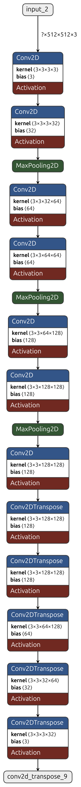
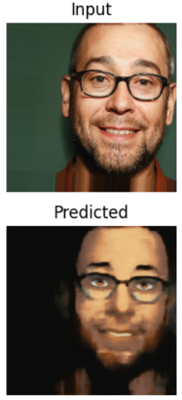

# Photo to Comic Model
Photo to Comic is a project that uses machine learning to convert real world face images to convert into its cartoon form. It uses autoencoder to compress and reconstruct images. The model is trained on the dataset of real face images and its corresponding cartoon images. The model is trained on the dataset of 8000 images and their corresponding comic versions.
The model is built to translate the input image into its cartoon form.

## Motivation
The project is inspired by the idea of converting real world images into the comic and anime version of themselves. With increase in the popularity of anime and manga, the project aims to provide a tool that can convert real world images into its cartoon form.

## Features
- Convert real world images into its cartoon form.
- Lightweight model that can be used on mobile devices.
- Easy to use and deploy.
- Easily customizable.

## Model Architecture
The model uses autoencoder to compress and reconstruct the images. The model is trained on the dataset of real face images and its corresponding cartoon images. The model is trained on the dataset of 8000 images and their corresponding comic versions. The model is built to translate the input image into its cartoon form.



## Installation
#### Requirements
- `>python 3.9.15`
- `>tensorflow 2.10.0`
- `numPy`
- `matplotlib`

### Clone the repository
```bash
git clone https://github.com/raichu03/photo2comic.git
```

### Uses
you can install the required packages and start using the already trained model. You can access the model using the by importing the file `predict.py` and use the fuction `get_prediction` to get the cartoon version of the image.

If you want to train the model on your own dataset, you can use the `model.py` file to train the model on youe own dataset.

Before training the model, you need to structure the dataset in the following way:

```
data/
    train/
        real/
        images
        ...

        cartoon/
        images
        ...

    validation/
        real/
        images
        ...

        cartoon/
        images
        ...

    test/
        real/
        images
        ...

        cartoon/
        images
        ...
```

## Datasets

The dataset used for training the model is the Comic Faces Paired Synthetic V2 dataset. The dataset contains 10000 images of real faces and their corresponding comic versions. The dataset is available on Kaggle and can be downloaded from the following link:

<https://www.kaggle.com/datasets/defileroff/comic-faces-paired-synthetic-v2>

## Training Details
- Epochs: 35
- Batch Size: 16
- Optimizer: Adam
- Loss: Mean Squared Error
- Hardware: NVIDIA GeForce RTX 4060 Laptop GPU

## Results


The above result shows the input image and its corresponding cartoon version generated by the model. While training the model, it had the loss of 0.12. The model is able to generate the cartoon version of the input image with acceptable accuracy.